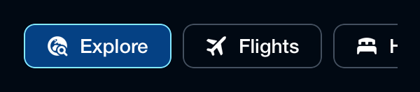

# Backpack-SwiftUI/NavigationTab

[](hhttps://cocoapods.org/pods/Backpack-SwiftUI)
[](https://backpack.github.io/ios/versions/latest/swiftui/Structs/BPKNavigationTabGroup.html)
[](https://github.com/Skyscanner/backpack-ios/tree/main/Backpack-SwiftUI/NavigationTab)

## Default (Horizontal)

| Day | Night |
| --- | --- |
|  |  |

## On Dark

| Day | Night |
| --- | --- |
|  |  |

## On Dark Alternate

| Day | Night |
| --- | --- |
|  |  |

## Vertical

| Day | Night |
| --- | --- |
|  |  |

## Vertical On Dark

| Day | Night |
| --- | --- |
|  |  |

## Usage

A group of navigation tabs that allows a single tab to be selected at a time.

### Basic Usage

```swift
import Backpack_SwiftUI

@State var selectedIndex = 0

let tabs: [BPKNavigationTabGroup.Item] = [
    .init(text: "Explore", icon: .explore),
    .init(text: "Flights", icon: .flight),
    .init(text: "Hotels", icon: .hotels),
    .init(text: "Car Hire", icon: .cars)
]

BPKNavigationTabGroup(
    tabs: tabs,
    selectedIndex: $selectedIndex
) { index in
    print("Selected tab: \(index)")
}
```

### Styles

Three styles are available: `.default`, `.onDark`, and `.onDarkAlternate`.

#### Default style (light backgrounds)

```swift
BPKNavigationTabGroup(
    tabs: tabs,
    style: .default,
    selectedIndex: $selectedIndex
) { index in }
```

#### On dark style (dark backgrounds)

```swift
BPKNavigationTabGroup(
    tabs: tabs,
    style: .onDark,
    selectedIndex: $selectedIndex
) { index in }
```

#### On dark alternate style (dark backgrounds with darker blue selection)

```swift
BPKNavigationTabGroup(
    tabs: tabs,
    style: .onDarkAlternate,
    selectedIndex: $selectedIndex
) { index in }
```

### Item Alignment

Two alignments are available: `.horizontal` (default) and `.vertical`.

#### Horizontal alignment (icon beside text)

```swift
BPKNavigationTabGroup(
    tabs: tabs,
    itemAlignment: .horizontal,
    selectedIndex: $selectedIndex
) { index in }
```

#### Vertical alignment (icon above text, pill shape)

```swift
BPKNavigationTabGroup(
    tabs: tabs,
    itemAlignment: .vertical,
    selectedIndex: $selectedIndex
) { index in }
```

### Combining Style and Alignment

```swift
// Vertical tabs on dark background
BPKNavigationTabGroup(
    tabs: tabs,
    style: .onDark,
    itemAlignment: .vertical,
    selectedIndex: $selectedIndex
) { index in }
```

### Tab Items

Each tab is defined using `BPKNavigationTabGroup.Item`:

```swift
let tab = BPKNavigationTabGroup.Item(
    text: "Flights",
    icon: .flight,  // Optional BPKIcon
    accessibilityIdentifier: "flightsTab"  // Optional, defaults to "navigationTab" + text
)
```
