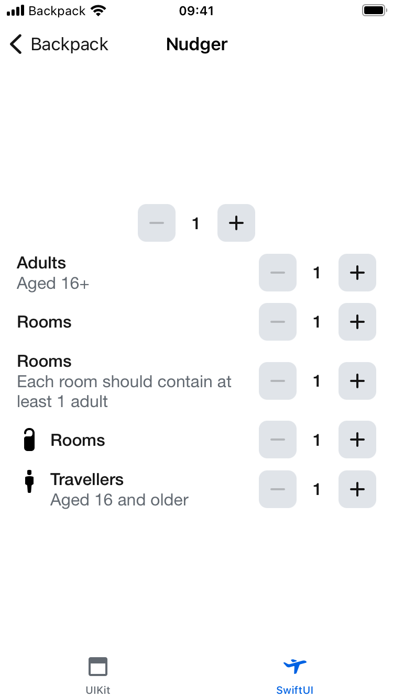
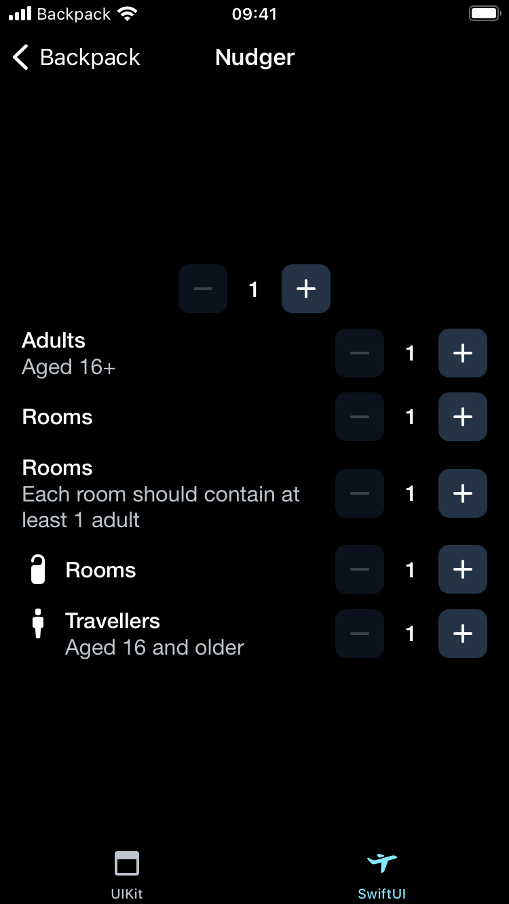

# Backpack-SwiftUI/Nudger

[](hhttps://cocoapods.org/pods/Backpack-SwiftUI)
[](https://backpack.github.io/ios/versions/latest/swiftui/Structs/BPKNudger.html)
[](https://github.com/Skyscanner/backpack-ios/tree/main/Backpack-SwiftUI/Nudger)

## Default

| Day | Night |
| --- | --- |
|  | |

# Usage

an adjustable control that allows a user to select a numerical value between a min/max determined by the consumer.

```swift
@State var value = 0

BPKNudger(value: $value, min: 1, max: 10, step: 1, accessibilityLabel: "")
```
